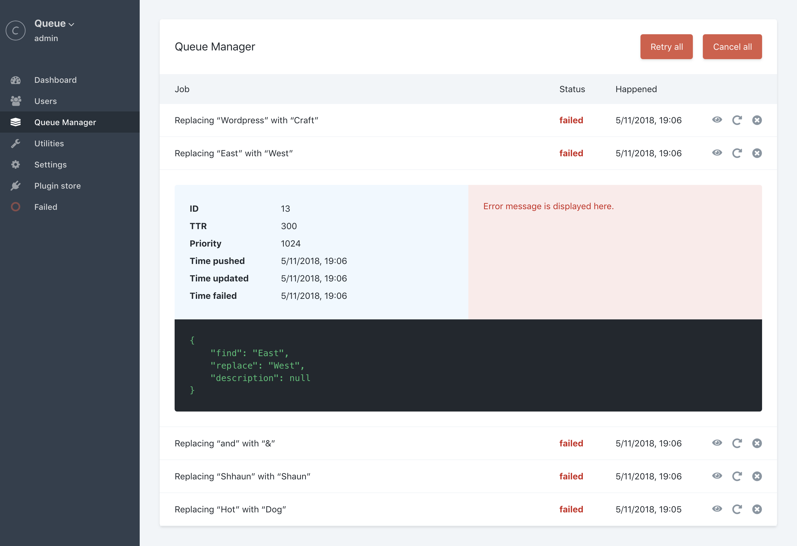

> **Warning**  
> This plugin has been abandoned in favor of the built-in queue manager utility (Craft 3.4.0 and newer).

---


# Queue Manager for Craft CMS 3

Job Queue Manager for Craft CMS.



## Installation

#### Requirements

This plugin requires Craft CMS 3.0.0, or later.

#### Plugin Store

Log into your control panel and click on 'Plugin Store'. Search for 'Queue Manager'.

#### Composer

1. Open your terminal and go to your Craft project:

```bash
cd /path/to/project
```

2. Then tell Composer to load the plugin:

```bash
composer require jalendport/craft-queuemanager
```

3. In the Control Panel, go to Settings → Plugins and click the “Install” button for Queue Manager.

## Features

- View detailed job information
- Retry or cancel individual jobs
- Retry or cancel the full queue
- Console commands that offer the same functionality as found in the CP

### Console commands

#### Retrying jobs

Individual:

```
./craft queue-manager/queue/retry id
```

Full queue:
```
./craft queue-manager/queue/retry-all
```

#### Cancelling jobs

Individual:

```
./craft queue-manager/queue/cancel id
```

Full queue:
```
./craft queue-manager/queue/cancel-all
```

## Overriding Plugin Settings

If you create a [config file](https://craftcms.com/docs/config-settings) in your `config` folder called `queue-manager.php`, you can override the plugin’s settings in the Control Panel. Since that config file is fully [multi-environment](https://craftcms.com/docs/multi-environment-configs) aware, this is a handy way to have different settings across multiple environments.

Here’s what that config file might look like along with a list of all of the possible values you can override.

```php
<?php

return [
    'jobLimit' => 1000,
];
```

| Parameter | Expected Value |
| --------- | -------------- |
| `jobLimit` | Integer |

## Roadmap

Some things to do, and ideas for potential features:

- Cron documentation
- Responsive tables
- Filter results
- Automatically refresh jobs
