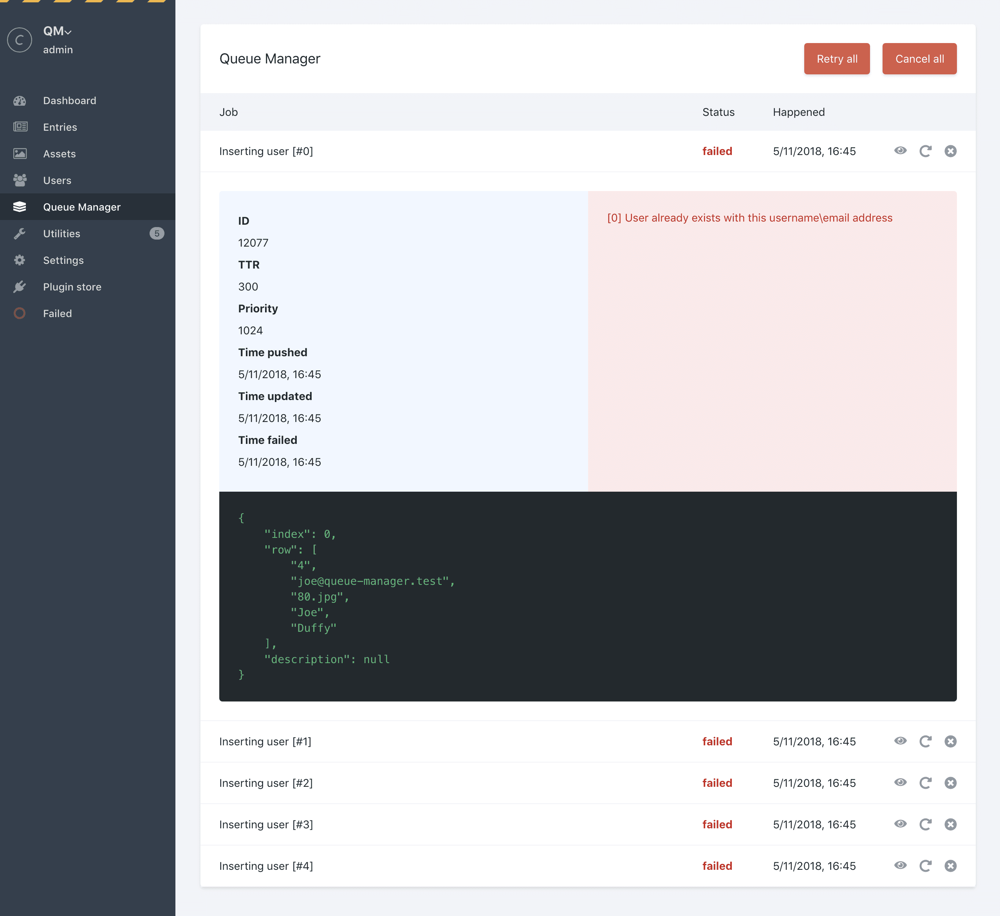

# Queue Manager for Craft CMS 3

Job Queue Manager for Craft CMS.



## Installation

#### Requirements

This plugin requires Craft CMS 3.0.0, or later.

#### Plugin Store

Log into your control panel and click on 'Plugin Store'. Search for 'Queue Manager'.

#### Composer

1. Open your terminal and go to your Craft project:

```bash
cd /path/to/project
```

2. Then tell Composer to load the plugin:

```bash
composer require lukeyouell/craft-queue-manager
```

3. In the Control Panel, go to Settings → Plugins and click the “Install” button for Queue Manager.

## Features

- View detailed job information
- Retry or cancel individual jobs
- Retry or cancel the full queue
- Console commands that offer the same functionality as found in the CP

### Console commands

#### Retrying jobs

Individual:

```
./craft queue-manager/queue/retry id
```

Full queue:
```
./craft queue-manager/queue/retry-all
```

#### Cancelling jobs

Individual:

```
./craft queue-manager/queue/cancel id
```

Full queue:
```
./craft queue-manager/queue/cancel-all
```

## Roadmap

Some things to do, and ideas for potential features:

- Cron documentation
- Responsive tables
- Filter results
- Automatically refresh jobs
